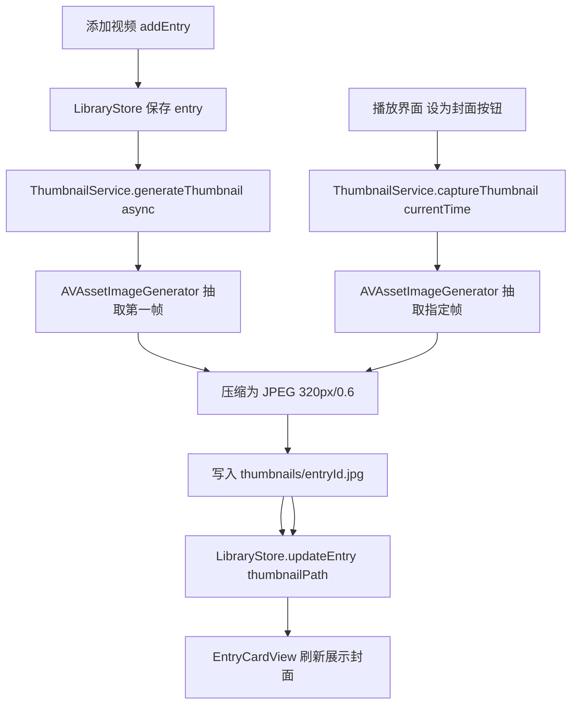
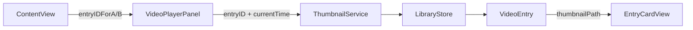

## 用户需求

为 ClimbReview（macOS SwiftUI 攀岩复盘应用）的视频库增加封面缩略图功能。

## 产品概述

视频库中每个视频卡片目前仅显示占位图标，需要升级为真实的视频缩略图封面，并支持在播放界面手动截取当前帧作为封面，同时做好图片压缩节约存储空间。

## 核心功能

1. **自动生成封面**：向视频库添加视频时，自动提取视频第一帧作为封面缩略图，后台异步执行不阻塞 UI
2. **视频库展示封面**：视频卡片的封面区域（高度 100pt）展示真实缩略图，未生成时显示原有占位图标作为降级兜底
3. **播放界面设置封面**：在视频播放面板的起点设置栏附近增加"设为封面"按钮，将当前播放帧截取并更新为该视频的封面
4. **图片压缩存储**：封面图片限制最大宽度 320px、以 JPEG 格式压缩（压缩系数约 0.6），存储于沙盒内 `~/Library/Application Support/ClimbReview/thumbnails/<entry-id>.jpg`
5. **封面同步**：播放界面设置封面后，视频库卡片实时刷新展示新封面

## 技术栈

- 语言/框架：Swift + SwiftUI（保持现有项目技术栈）
- 视频抽帧：`AVAssetImageGenerator`（AVFoundation，项目已引入）
- 图片压缩：`NSBitmapImageRep` + JPEG 编码（macOS 原生，无需第三方库）
- 数据持久化：现有 JSON + 新增 thumbnails 目录文件存储
- 异步执行：`DispatchQueue.global(qos: .utility)` 后台抽帧，`DispatchQueue.main` 回调更新 UI

## 实现方案

### 核心策略

新增 `ThumbnailService` 单例负责封面的生成、压缩和文件管理，与现有 `LibraryStore` 解耦。`VideoEntry` 增加 `thumbnailPath` 可选字段（向后兼容 Codable），`LibraryStore.addEntry` 完成后异步触发封面生成并回写 entry。播放界面通过回调将 entry id 和当前时间传给 `ThumbnailService`，生成后调用 `LibraryStore.updateEntry` 并通过 `@Published` 触发视图刷新。

### 关键技术决策

1. **封面存储为独立文件而非嵌入 JSON**：缩略图数据较大，内联 Base64 会使 library.json 膨胀，独立 jpg 文件读写更高效，且可按需加载
2. **异步抽帧防止 UI 卡顿**：`AVAssetImageGenerator.generateCGImageAsynchronously` 在后台线程执行，不阻塞主线程
3. **压缩参数**：先缩放到最大宽度 320px（保持宽高比），再以 JPEG compressionFactor 0.6 编码，典型封面文件 < 20KB
4. **视图层懒加载**：`EntryCardView` 使用 `AsyncImage` 风格的 `Image(nsImage:)` + `onAppear` 加载本地文件，避免网格滚动时的重复 IO，利用 `@State private var thumbnail: NSImage?` 做本地缓存

### 数据流



## 实现注意事项

- **向后兼容**：`thumbnailPath: String? = nil` 默认值确保旧 JSON 数据反序列化不报错
- **文件覆盖**：设置新封面时直接覆盖旧文件（同名 `<entry-id>.jpg`），无需删除旧文件
- **删除联动**：`LibraryStore.deleteEntry` 同时删除对应缩略图文件
- **沙盒权限**：thumbnails 目录在 Application Support 内，沙盒可写，无需额外 entitlements
- **播放界面同步**：`VideoPlayerPanel` 需接收当前 entry id（由 `ContentView` 传入），设为封面后通过 `store.updateEntry` 触发 `@Published` 自动刷新视图
- **避免重复 IO**：`EntryCardView` 用 `@State thumbnail` 缓存已加载图片，`onChange(of: entry.thumbnailPath)` 时才重新加载

## 架构设计



## 目录结构

```
ClimbReview/
├── ClimbReview/
│   ├── LibraryModel.swift         [MODIFY] VideoEntry 增加 thumbnailPath: String? = nil 字段
│   ├── LibraryStore.swift         [MODIFY] addEntry 后触发异步封面生成；deleteEntry 联动删除缩略图文件；新增 thumbnailsDirectory 路径属性
│   ├── ThumbnailService.swift     [NEW] 封面生成服务。提供 generateThumbnail(for entry, url) 和 captureThumbnail(for entryID, from player, at time) 两个异步方法；内部使用 AVAssetImageGenerator 抽帧，NSBitmapImageRep 压缩至 320px JPEG(0.6)，写入 thumbnails 目录；对外暴露 thumbnailsDirectory: URL
│   ├── LibraryView.swift          [MODIFY] EntryCardView 封面区替换占位图为真实缩略图：增加 @State thumbnail: NSImage?，onAppear/onChange 加载本地 jpg 文件，有图显示 Image(nsImage:) 否则降级显示原占位图标
│   ├── VideoPlayerPanel.swift     [MODIFY] VideoPlayerPanel 增加 entryID: UUID? 和 store: LibraryStore 参数；在 startPointBar 附近增加"设为封面"按钮，点击后调用 ThumbnailService.captureThumbnail；VideoPlayerViewModel 无需改动
│   └── ContentView.swift          [MODIFY] loadEntry 时将 entry.id 传给对应 VideoPlayerPanel；playerView 构建时传入 store 和 entryIDForA/B
```